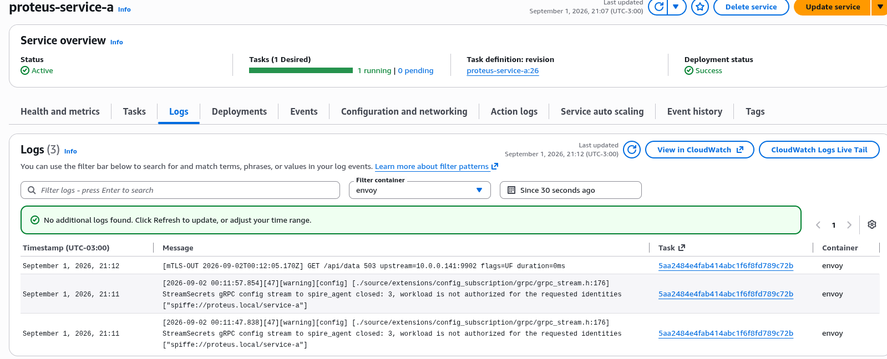
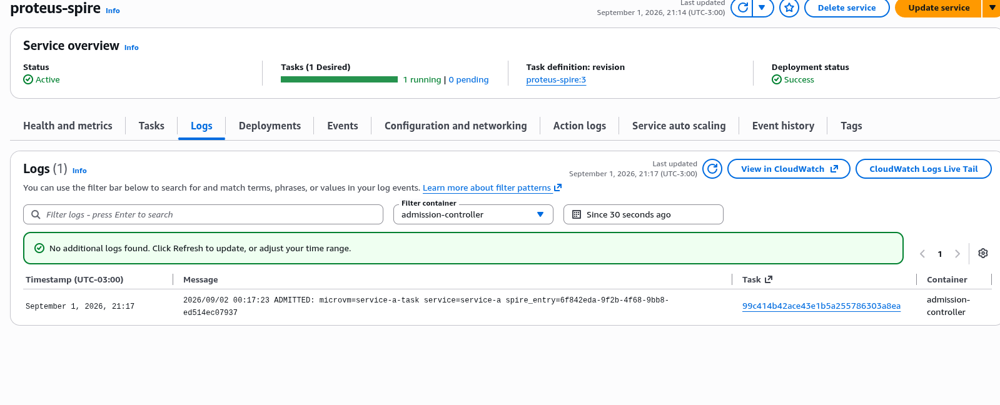
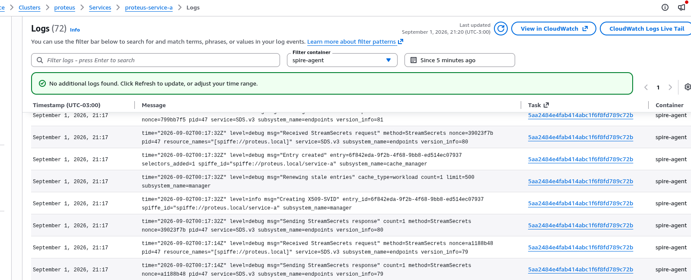
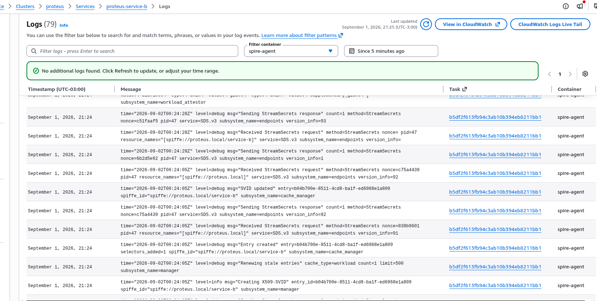
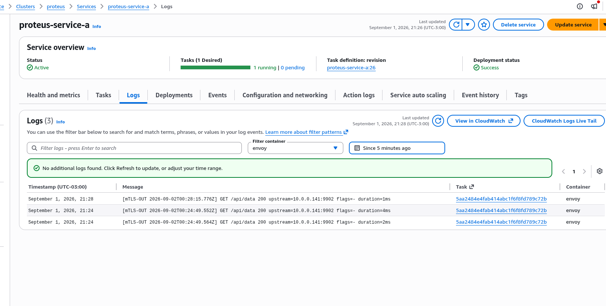

# Evidence: Dark by Default → Live After Admit

This is the proof, captured live from the running ECS Fargate cluster. Read it
bottom-to-top of the trust story: tasks attest automatically, sit dark, and only
go live once the gatekeeper admits them.

---

## 1. Auto-attestation — tasks join with no tokens

Every task runs a SPIRE Agent that attests automatically using the custom
`proteus_ecs` node attestor (reads ECS task metadata → server verifies via
`DescribeTasks`). No join tokens, no manual steps.

```
$ spire-server agent list

Found 4 attested agents:
SPIFFE ID         : spiffe://proteus.local/agent/ecs/5aa2484e4fab414abc1f6f8fd789c72b
Attestation type  : proteus_ecs
SPIFFE ID         : spiffe://proteus.local/agent/ecs/b5df2f613fb94c3ab10b394eb8211bb1
Attestation type  : proteus_ecs
...
```


> The `Attestation type: proteus_ecs` is the custom attestor doing the work.

---

## 2. DARK — service-a has no identity

The task is attested (the agent is connected) but **not admitted** (no workload
entry). So SPIRE refuses to issue a certificate.

**service-a's SPIRE Agent — the request is refused:**

```
Error building stream secrets response
  error="workload is not authorized for the requested identities
         [\"spiffe://proteus.local/service-a\"]"
```


**service-a's Envoy — no certificate held:**

```
$ curl http://127.0.0.1:15000/certs
{
 "certificates": []
}
```



**The peer call fails (mТLS can't start):**

```
$ curl http://127.0.0.1:9903/api/data
upstream connect error or disconnect/reset before headers.
transport failure reason: TLS error: Secret is not supplied by SDS

$ curl -o /dev/null -w "%{http_code}" http://127.0.0.1:9903/api/data
503
```

In Envoy's access log (service-a `envoy` stream):

```
[mTLS-OUT 2026-09-02T00:19:58Z] GET /api/data 503 upstream=10.0.0.141:9902 flags=UF duration=0ms
```

> `flags=UF` = upstream failure. service-a literally cannot reach service-b —
> not because of a network rule, but because it has no identity to present.

---

## 3. ADMIT — the gatekeeper grants identity

An admin calls the admission-controller API (`POST /admit`). The controller
creates the SPIRE workload entry. This is the ONLY way in.

```
$ curl -X POST http://localhost:8090/admit \
    -H "Content-Type: application/json" \
    -d '{"microvm_id":"service-a-task","service_name":"service-a",
         "agent_id":"spiffe://proteus.local/agent/ecs/5aa2484e..."}'

{"service_name":"service-a","spire_entry_id":"6f842eda-...","admitted_at":"..."}
```

**Admission-controller log (both services admitted):**

```
2026/09/02 00:17:23 ADMITTED: microvm=service-a-task service=service-a spire_entry=6f842eda-...
2026/09/02 00:24:01 ADMITTED: microvm=service-b-task service=service-b spire_entry=b04b700e-...
```




---

## 4. LIVE — certificates are issued

Seconds after admission, the SPIRE Agent mints the SVID and pushes it to Envoy
over SDS. The "not authorized" error is gone.

**service-a agent — cert created:**

```
00:17:32 INFO  Creating X509-SVID  spiffe_id="spiffe://proteus.local/service-a"
00:17:32 DEBUG SVID updated        spiffe_id="spiffe://proteus.local/service-a"
00:17:32 DEBUG Sending StreamSecrets response count=1
```



**service-b agent — cert created:**

```
00:24:05 INFO  Creating X509-SVID  spiffe_id="spiffe://proteus.local/service-b"
00:24:05 DEBUG SVID updated        spiffe_id="spiffe://proteus.local/service-b"
```



---

## 5. mTLS works — and the peer is verified

With both admitted, service-a calls service-b through Envoy egress. The mТLS
handshake succeeds and each side cryptographically verifies the other's SPIFFE
identity.

**service-a Envoy — outbound success (503 → 200):**

```
[mTLS-OUT 2026-09-02T00:19:58Z] GET /api/data 503 flags=UF   ← before admit (DARK)
[mTLS-OUT 2026-09-02T00:24:49Z] GET /api/data 200 flags=-    ← after admit (LIVE)
```



**service-b Envoy — inbound, peer identity verified (the climax):**

```
[mTLS-IN 2026-09-02T00:24:49Z] GET /api/data 200
  peer=spiffe://proteus.local/service-a
  tls=TLSv1.2
  subject="O=SPIRE,C=US"
  issuer="...O=SPIFFE,C=US"
```


> `peer=spiffe://proteus.local/service-a` — service-b confirms *who* called it,
> cryptographically, over mutual TLS. This is the whole point.

**service-b app — the request finally arrives:**

```
[service-b] /api/data request received from 127.0.0.1:53096
```

**The response, end to end:**

```json
{"data":"hello from service-b","source":"service-b","time":"2026-09-02T00:24:49Z"}
```

---

## The one-line summary

```
DARK:  workload is not authorized  →  certificates: []  →  503 UF
              │ admit via gatekeeper
              ▼
LIVE:  Creating X509-SVID  →  [mTLS-OUT] 200  →  [mTLS-IN] peer=spiffe://.../service-a
```

Attestation says "you are a real task." Admission says "you get an identity."
Only with both does traffic flow — and every hop is mutually authenticated.

---

### Note on capturing these (why some containers are hard to exec)

Because the task definitions use `pidMode: task`, ECS Exec (SSM) attaches
non-deterministically to one container. In practice the `envoy` container was
reachable; the `app` container often returned `TargetNotConnected`. All
`localhost` ports (`:9903` egress, `:15000` admin) are reachable from any
container in the task since they share the network namespace — so the tests were
run from the `envoy` container. See `ECS_EXEC_PIDMODE.md` for the full finding.
