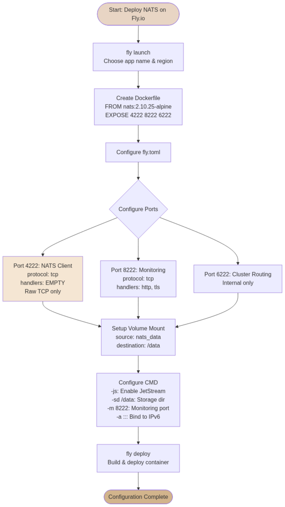
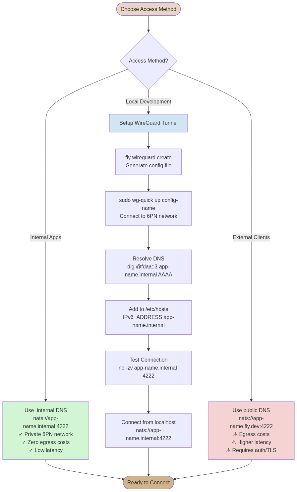
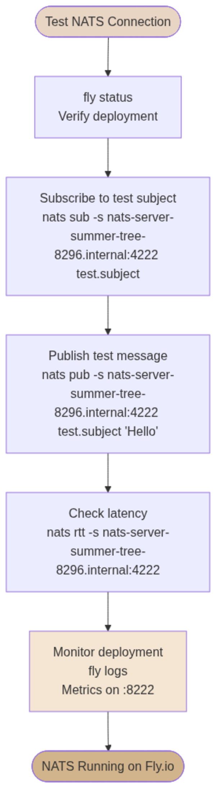

---
title:
  en: 'NATS server on fly.io'
  es: 'Instalación de NATS server en fly.io'
excerpt:
  en: 'Clear instructions to install and put NATS on fly.io'
  es: 'Instalación sencilla de NATS en fly.io'
date: 2026-01-31
tags: ['nats-sever', 'nats', 'fly.io']
draft: true
---

<div class="lang-en">
I needed a nats server to use as my broker message, I have choose to install it on fly.io, I have follow the instructions on the official documentation and I have found some issues, so I want to share with you how to install nats server on fly.io without any problem.

The `dockerfile` can be used to deploy a nats

```
FROM nats:2.10.25-alpine

# Expose client, management, and routing ports
EXPOSE 4222 8222 6222

# Default entrypoint is already "nats-server"
CMD ["-js", "-sd", "/data", "-m", "8222"]
~                                               


````

To ensure right connection we need to use wireguard to stablish a secure connection from local to nats server.
The diagram to understand this is in the following images





</div>

<div class="lang-es hidden">
</div>
