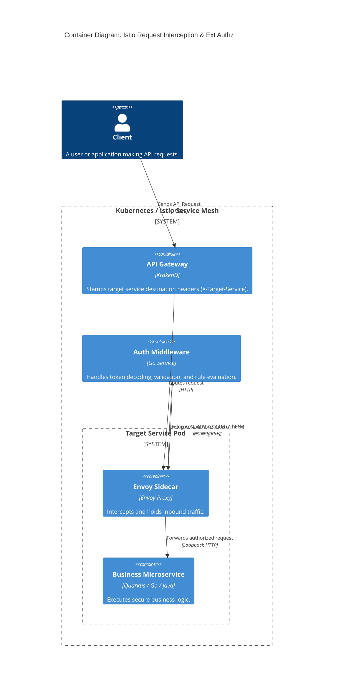
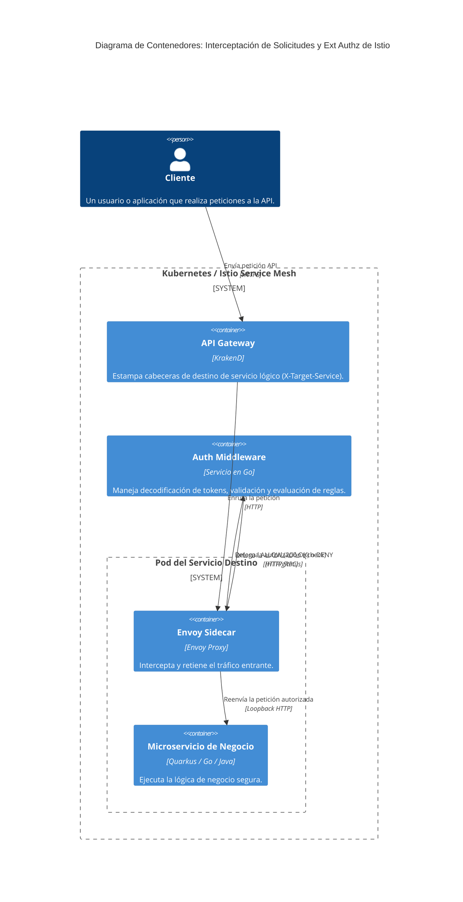

---
title:
  en: 'Building an external authorization extension with middleware'
  es: 'Construyendo una extensión de autorización externa con middleware'
excerpt:
  en: 'A step-by-step guide on how to build a highly optimized HTTP/gRPC external authorizer middleware for Istio and secure your services at the mesh layer.'
  es: 'Una guía paso a paso sobre cómo construir un middleware autorizador externo HTTP/gRPC altamente optimizado para Istio y asegurar tus servicios en la capa de mesh.'
date: 2026-08-08
tags: ['authorization', 'middleware', 'istio', 'go', 'security']
draft: true
---

<div class="lang-en">

## Offloading Security to the Service Mesh

Modern architectures demand that we decouple security policies from business logic. Implementing authorization logic inside individual microservices creates code duplication and introduces potential security vulnerabilities if an endpoint is forgotten. 

By leveraging **Istio's CUSTOM External Authorization (`ext_authz`)**, we can intercept incoming requests right at the Envoy sidecar proxy level and delegate validation to a dedicated, high-performance middleware service.

### The Interception Flow

Here is how Istio interacts with our external authorizer middleware:

1. **Request Inflow**: Client hits the service endpoint.
2. **Envoy Interception**: The sidecar proxy catches the inbound request and pauses the connection.
3. **Check Request**: Envoy extracts specified headers (e.g., `Authorization`, path, custom tracking headers) and forwards them to our custom external authorizer middleware via HTTP/gRPC.
4. **Decision**:
   - **Allowed (HTTP 200)**: The request continues to the backend container.
   - **Denied (HTTP 403 / 401)**: Envoy short-circuits the request and returns the error directly to the client.



---

## Building the External Authorizer Middleware in Go

Go is an excellent choice for writing external authorizers due to its low memory footprint, rapid startup times, and rich networking capabilities. Below is a complete example of an HTTP-based authorizer middleware designed for Istio:

```go
package main

import (
	"fmt"
	"log"
	"net/http"
	"strings"
)

func main() {
	http.HandleFunc("/check", checkAuth)
	log.Println("Auth middleware listening on :8080...")
	if err := http.ListenAndServe(":8080", nil); err != nil {
		log.Fatalf("Failed to start server: %v", err)
	}
}

func checkAuth(w http.ResponseWriter, r *http.Request) {
	// 1. Extract context headers forwarded by Istio Envoy
	authHeader := r.Header.Get("Authorization")
	targetService := r.Header.Get("X-Target-Service")
	
	log.Printf("Received check request for service: %s", targetService)

	// 2. Validate Token (In production, decode and verify your JWT/Token)
	if authHeader == "" || !strings.HasPrefix(authHeader, "Bearer ") {
		log.Println("Authorization header missing or invalid format")
		w.WriteHeader(http.StatusUnauthorized)
		return
	}

	token := strings.TrimPrefix(authHeader, "Bearer ")
	
	// 3. Evaluate access rules (Example of path or metadata matching)
	if !isValidToken(token) {
		log.Println("Token validation failed")
		w.WriteHeader(http.StatusForbidden)
		return
	}

	// 4. Respond with 200 OK to allow request, optionally adding enrichment headers
	log.Printf("Request authorized for service %s", targetService)
	w.Header().Set("X-Authorized-User", "user-123") // Envoy can forward this to your app!
	w.WriteHeader(http.StatusOK)
}

func isValidToken(token string) bool {
	// TODO: Add your custom logic here (JWT verification, rule evaluation etc.)
	return token == "super-secret-token"
}
```

---

## Your Turn: Add your custom notes and implementation details

[TODO: Add details here about how your specific middleware handles authorization, any caching strategies, or design patterns you implemented to keep it lightweight.]

</div>

<div class="lang-es hidden">

## Delegando la Seguridad al Service Mesh

Las arquitecturas modernas exigen que separemos las políticas de seguridad de la lógica de negocio. Implementar lógica de autorización dentro de microservicios individuales crea duplicidad de código e introduce posibles vulnerabilidades de seguridad si se olvida algún endpoint.

Al aprovechar la **Autorización Externa CUSTOM de Istio (`ext_authz`)**, podemos interceptar las solicitudes entrantes directamente a nivel del proxy sidecar de Envoy y delegar la validación a un servicio middleware dedicado de alto rendimiento.

### El Flujo de Interceptación

Así interactúa Istio con nuestro middleware autorizador externo:

1. **Entrada de Solicitud**: El cliente realiza una petición al endpoint del servicio.
2. **Interceptación de Envoy**: El proxy sidecar captura la solicitud entrante y pausa la conexión.
3. **Solicitud de Verificación**: Envoy extrae cabeceras específicas (por ejemplo, `Authorization`, ruta, cabeceras de seguimiento personalizadas) y las envía a nuestro middleware autorizador externo a través de HTTP/gRPC.
4. **Decisión**:
   - **Permitido (HTTP 200)**: La solicitud continúa hacia el contenedor del backend.
   - **Denegado (HTTP 403 / 401)**: Envoy corta la solicitud de inmediato y devuelve el error directamente al cliente.



---

## Construyendo el Middleware Autorizador Externo en Go

Go es una excelente opción para escribir autorizadores externos debido a su bajo consumo de memoria, tiempos de inicio rápidos y ricas capacidades de red. A continuación, se presenta un ejemplo completo de un autorizador basado en HTTP diseñado para Istio:

```go
package main

import (
	"fmt"
	"log"
	"net/http"
	"strings"
)

func main() {
	http.HandleFunc("/check", checkAuth)
	log.Println("Auth middleware listening on :8080...")
	if err := http.ListenAndServe(":8080", nil); err != nil {
		log.Fatalf("Failed to start server: %v", err)
	}
}

func checkAuth(w http.ResponseWriter, r *http.Request) {
	// 1. Extraer cabeceras de contexto enviadas por Istio Envoy
	authHeader := r.Header.Get("Authorization")
	targetService := r.Header.Get("X-Target-Service")
	
	log.Printf("Petición de verificación recibida para el servicio: %s", targetService)

	// 2. Validar el Token (En producción, decodifica y verifica tu JWT/Token)
	if authHeader == "" || !strings.HasPrefix(authHeader, "Bearer ") {
		log.Println("Cabecera de autorización ausente o formato inválido")
		w.WriteHeader(http.StatusUnauthorized)
		return
	}

	token := strings.TrimPrefix(authHeader, "Bearer ")
	
	// 3. Evaluar reglas de acceso (Ejemplo de coincidencia de ruta o metadatos)
	if !isValidToken(token) {
		log.Println("Fallo en la validación del token")
		w.WriteHeader(http.StatusForbidden)
		return
	}

	// 4. Responder con 200 OK para permitir la solicitud, opcionalmente agregando cabeceras de enriquecimiento
	log.Printf("Solicitud autorizada para el servicio %s", targetService)
	w.Header().Set("X-Authorized-User", "user-123") // ¡Envoy puede reenviar esto a tu aplicación!
	w.WriteHeader(http.StatusOK)
}

func isValidToken(token string) bool {
	// TODO: Agrega tu lógica personalizada aquí (verificación JWT, evaluación de reglas, etc.)
	return token == "super-secret-token"
}
```

---

## Tu turno: Agrega tus notas personalizadas y detalles de implementación

[TODO: Agrega detalles aquí sobre cómo tu middleware específico maneja la autorización, cualquier estrategia de caché o patrones de diseño que implementaste para mantenerlo ligero.]

</div>

